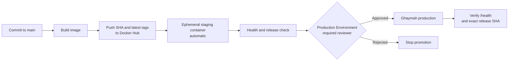

# CI/CD Pipeline for Ghaymah

## Pipeline overview

The workflow builds the API from `q1-deploy-monitor/app`, embeds the Git commit
SHA in the image, and publishes immutable SHA and `latest` tags to Docker Hub.
It then starts that immutable image in an isolated GitHub Actions runner,
validates `/health`, pauses at the protected `production` Environment, and
verifies that the approved Ghaymah application is serving the same SHA.



The free Ghaymah account used for this assessment permits five total resources.
The two required deployed applications (`ghaymah-api` and `mithal-monitor`) already
consume the available allocation together with their supporting resources. A
third Ghaymah application was tested and rejected by the platform with the
documented account message `Resource limit exceeded ... maximum 5 resources`.
Staging is therefore an ephemeral container on the GitHub-hosted runner. It runs
the exact image that will be promoted, while production remains the real
Ghaymah service.

The workflow runs on a push to `main` and through `workflow_dispatch`. It uses:

| Setting | Purpose |
|---|---|
| Secret `DOCKERHUB_USERNAME` | Docker Hub account and image namespace. |
| Secret `DOCKERHUB_TOKEN` | Read/write Docker Hub access token. |
| Variable `GHAYMAH_STAGING_APP` | Display name for the ephemeral staging service. |
| Variable `GHAYMAH_PRODUCTION_APP` | Name of the deployed Ghaymah application. |
| Variable `GHAYMAH_PRODUCTION_URL` | Public base URL used for the production verification. |

Images are published as:

```text
docker.io/agamy74/ghaymah-api:<git-commit-sha>
docker.io/agamy74/ghaymah-api:latest
```

Only the SHA tag is promoted. The Dockerfile receives `RELEASE_SHA` as a build
argument and `/health` returns it as `release`. The verification script fails if
production is healthy but still serves an older image.

## Manual approval

The production gate is implemented through a GitHub Environment named
`production`:

```yaml
environment: production
```

Required reviewers are configured in **Settings → Environments → production**,
not in YAML. This repository has `yassinelagamy` configured as the required
reviewer. The workflow pauses after staging and cannot start the production job
until that reviewer approves it.

Because Ghaymah CLI `0.0.24` does not document non-interactive token
authentication or the external-image update field, promotion currently uses
this controlled procedure:

1. The workflow builds and verifies the immutable image in staging.
2. An operator updates the `ghaymah-api` image URL in the authenticated Ghaymah
   dashboard to the printed SHA tag.
3. The required reviewer approves the GitHub `production` Environment.
4. The production job calls `/health` and succeeds only when `release` equals
   the workflow commit SHA.

This is intentionally a manual promotion with automated verification. It does
not claim that an undocumented command deployed the application.

## Staging vs Production

| Area | Staging | Production |
|---|---|---|
| Purpose | Validate the exact candidate image before promotion. | Serve the public workload on Ghaymah. |
| Data | Synthetic or disposable test data. | Real application data and traffic. |
| Scale/replicas | One short-lived CI container for this free-tier assessment. | Ghaymah instance sized for availability and measured demand. |
| Secrets | Only build/test credentials; no production secrets. | Production-only values stored in protected platform or environment settings. |
| Access control | Reachable only inside the GitHub Actions runner. | Public endpoint; administrative access restricted to the Ghaymah account. |
| Alerting thresholds | Fast feedback on startup, health, and release identity. | SLO-based uptime, latency, memory, restart, and OOM alerts. |
| Deploy cadence | Automatic on each push to `main`. | Manual promotion after successful staging. |
| Who can approve | No reviewer required. | Required reviewer on the GitHub `production` Environment. |

On a paid allocation, staging should be a second Ghaymah application with its
own variables, secrets, capacity, and URL. The image and release verification
steps remain unchanged.

## Ghaymah CLI integration

The verified public CLI installation and inspection commands are:

```bash
# Ghaymah-specific installation command confirmed from the official documentation.
curl -sSL https://cli.ghaymah.systems/install.sh | bash

# Ghaymah-specific commands confirmed with CLI 0.0.24.
gy version
gy auth login --email '<email>' --password '<password>'
gy auth status
gy resource project get
gy resource app init --project-id '<project-id>' --name '<app-name>'
gy resource app launch .
gy resource app logs
gy resource app update '<app-id>' --set '<documented-fields>'
```

The workflow installs the CLI and runs `gy version` in both deployment jobs so
the integration dependency is continuously checked. It does not place a user
password in CI. Public CLI help for version `0.0.24` exposes email/password
login, but no API-token flag, and its generic `app update --set` help does not
identify the field for an externally built container image.

The authenticated dashboard does provide a verified deployment route: enter a
container image URL, application name, port, public-access choice, environment
variables, and an optional registry pull secret, then deploy or update the
application. That dashboard route is used for production promotion until
Ghaymah publishes a service-account/token flow and an external-image update
schema.

`scripts/verify_deployment.sh` is the CI boundary after promotion:

```bash
bash scripts/verify_deployment.sh \
  --app "$GHAYMAH_APP_NAME" \
  --url "$GHAYMAH_PRODUCTION_URL" \
  --expected-release "$GITHUB_SHA"
```

It retries `/health`, requires `status=ok`, compares the deployed `release` to the
approved SHA, writes evidence to the GitHub job summary, and exits nonzero for
an unavailable or stale deployment.

Official references:

- [Ghaymah CLI documentation](https://ghaymah.systems/docs)
- [Ghaymah CLI overview](https://ghaymah.systems/cli)
- [Docker login action](https://github.com/docker/login-action)
- [Docker build and push action](https://github.com/docker/build-push-action)
