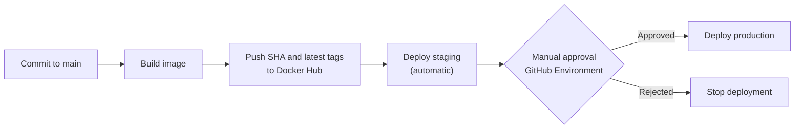

# CI/CD Pipeline for Ghaymah

## Pipeline overview

The workflow builds the API from `q1-deploy-monitor/app`, publishes two Docker Hub tags, deploys the immutable commit tag to a separate staging application, pauses for manual approval, and then deploys the exact same image to production. Promoting the same immutable `${{ github.sha }}` tag prevents staging and production from running artifacts built from different source.



The workflow runs on:

- A push to `main`.
- A manual `workflow_dispatch` run.

It uses these GitHub Actions secrets:

| Secret | Purpose |
|---|---|
| `DOCKERHUB_USERNAME` | Docker Hub account/namespace used to authenticate and construct the image name. |
| `DOCKERHUB_TOKEN` | Docker Hub access token used to push images. |
| `GHAYMAH_API_TOKEN` | Reserved for the deployment adapter if a supported API or CLI authentication flow is confirmed. |

Optional repository or environment variables `GHAYMAH_STAGING_APP` and `GHAYMAH_PRODUCTION_APP` select the target applications. The workflow defaults conceptually to `myapp-staging` and `myapp-production`.

Images are published as:

```text
docker.io/<user>/ghaymah-api:<git-commit-sha>
docker.io/<user>/ghaymah-api:latest
```

The SHA tag is used for deployment because it is immutable and auditable. `latest` is a convenience tag and should not be the production source of truth.

Ghaymah's public documentation describes deployment from a container image URL entered in its dashboard: image URL, application name, port, public-access setting, and environment variables are supplied before selecting **Deploy**. A Ghaymah-hosted registry is not assumed. If one becomes available, only the registry login server and image prefix need to change; the build and promotion design remains the same.

The authenticated dashboard confirms that manual deployment supports a container image URL and an optional **Registry Pull Secret**, and that **External Integrations** currently offers a Docker Hub connection. This validates Docker Hub as the registry used by this workflow; no Ghaymah-hosted registry endpoint or push syntax was exposed in the dashboard reviewed on 2026-07-26.

## Manual approval

Manual approval is implemented with a GitHub Environment named `production`. The workflow declares:

```yaml
environment: production
```

Required reviewers are configured in the GitHub repository UI, not in workflow YAML:

1. Open **Settings → Environments**.
2. Create or select the `production` environment.
3. Enable the deployment protection rule for required reviewers.
4. Add the people or teams authorized to approve production deployments.
5. Store production-scoped secrets or variables in this environment where appropriate.

After staging succeeds, the `deploy-production` job enters a waiting state. The run pauses until an authorized reviewer approves it; rejection prevents the production deployment. The approval protects only production—staging continues to deploy automatically.

## Staging vs Production

Staging and production should be two separate Ghaymah applications, such as `myapp-staging` and `myapp-production`, with independent configuration and environment variables.

| Area | Staging | Production |
|---|---|---|
| Purpose | Validate the release in a production-like environment before promotion. | Serve the live customer workload. |
| Data | Synthetic, anonymized, or disposable test data. | Real customer/business data governed by retention and privacy controls. |
| Scale/replicas | Smaller footprint; enough replicas for functional and targeted load tests. | Sized for peak traffic, resilience, and operational headroom. |
| Secrets | Staging-only credentials with limited permissions. | Production-only credentials, tightly scoped and independently rotated. |
| Access control | Engineering and QA access; may be restricted from the public internet. | Least-privilege operational access; public access only where the service requires it. |
| Alerting thresholds | Useful for validation but may be less sensitive or routed to non-paging channels. | SLO-based thresholds with paging for user-impacting failures. |
| Deploy cadence | Automatic after each successful build from `main`. | Only after staging succeeds and a reviewer approves the deployment. |
| Who can approve | No approval required for this pipeline. | Reviewers assigned to the GitHub `production` Environment. |

Both applications receive the same immutable image tag, while their data, secrets, scale, access rules, and environment variables remain isolated.

## Ghaymah CLI integration

### Verified public CLI commands

Ghaymah now publicly documents the `gy` CLI, including installation, interactive login, project management, Dockerfile-based application initialization and launch, and log retrieval. The currently documented flow is:

```bash
curl -sSL https://cli.ghaymah.systems/install.sh | bash
source ~/.bashrc
gy version
gy auth login
gy auth status
gy resource project get
gy resource app init --project-id <PROJECT_ID> --name <APP_NAME>
gy resource app launch [PATH]
gy resource app logs
gy resource app update <APP_ID> --set '<CONFIRMED_UPDATE_FIELDS>'
```

`app init` creates `.ghaymah.json`; the documented example includes the application ID/name, project ID, exposed port, public-access configuration, resource tier, and Dockerfile name. `app launch` builds the local Dockerfile and deploys that application.

Official sources:

- [Ghaymah CLI documentation](https://ghaymah.systems/docs)
- [Ghaymah CLI overview](https://ghaymah.systems/cli)

### CI integration gap

Direct inspection of CLI version `0.0.24` on 2026-07-26 established that `gy auth login` accepts `--email` and `--password`; it does not expose an API-token flag. It also established that `gy resource app update <APP_ID>` accepts JSON input or dot notation through `--set`.

The public documentation and CLI help still do **not** specify:

- A `GHAYMAH_API_TOKEN` login flow suitable for an ephemeral GitHub Actions runner.
- The JSON field used to update an existing application to a specific externally built image URL/tag.
- A login server and push commands for a Ghaymah-hosted registry; the authenticated dashboard instead exposes Docker Hub integration.

<!-- VERIFY: Confirm whether Ghaymah supports API-token authentication and identify the external-image field accepted by `gy resource app update`. -->

Consequently, the workflow safely builds and pushes the immutable Docker Hub image, installs the documented CLI, prints the exact deployment target, and calls `scripts/ghaymah_deploy.sh`. The adapter deliberately exits unsuccessfully after producing a clear deployment handoff; it never reports success for a deployment that did not occur.

Until the missing CI syntax is confirmed, the image deployment procedure is:

1. Open the target Ghaymah application in the dashboard.
2. Update its container image URL to `docker.io/<user>/ghaymah-api:<git-commit-sha>`.
3. Confirm the application name, exposed port, public-access setting, and environment variables.
4. Select **Deploy** and validate application health.
5. Repeat for production only after the GitHub Environment approval.

The staging and production workflow steps print the exact SHA-tagged image and target application, then call:

<!-- VERIFY: Replace this fail-safe adapter with confirmed non-interactive authentication and external-image update syntax. -->

```bash
bash scripts/ghaymah_deploy.sh \
  --app "$GHAYMAH_APP_NAME" \
  --image "$DEPLOY_IMAGE"
```

The workflow supplies `GHAYMAH_API_TOKEN` through the environment and never places it in a command-line argument. Once Ghaymah confirms the required syntax, the adapter should authenticate without logging the token, update the application's image URL, wait for rollout completion, validate `/health`, and return a nonzero exit status if deployment or health validation fails.
