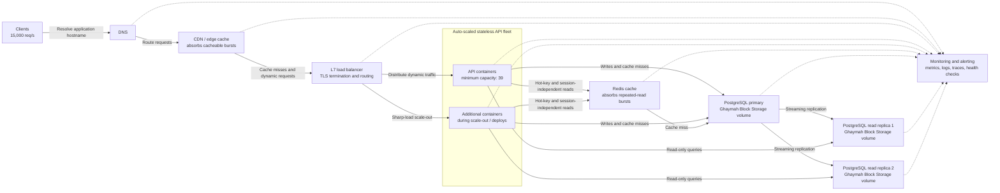

# Scalability and Load Distribution on Ghaymah

## 1. Architecture for 15,000 requests per second



The normal request path is **DNS → CDN/edge cache → L7 load balancer → stateless API container**. Cacheable content is answered at the CDN edge, so it does not consume API capacity. Dynamic requests reach the container fleet, where Redis absorbs repeated reads and hot-key bursts. Database writes go to the PostgreSQL primary, while eligible read-only traffic is distributed across read replicas. The monitoring component observes health, throughput, saturation, latency, errors, logs, and traces across every tier.

The CDN and Redis cache are the first two burst buffers. They reduce the amount of work reaching the API and database, but capacity planning still assumes the API may need to handle the full 15,000 req/s. This conservative assumption prevents cache misses, invalidation events, or an unusually write-heavy workload from immediately exhausting the fleet.

## 2. Container count calculation

Given:

- Peak application load: **15,000 req/s**
- Tested capacity per container: **500 req/s**
- Required headroom: **30%**

Base container count:

```text
15,000 req/s ÷ 500 req/s per container = 30 containers
```

Add 30% headroom:

```text
30 × 1.30 = 39 containers
```

**Answer: 39 application containers.**

Capacity calculations must always round fractional results up to the next whole container. The fleet should also permit at least **N+1**, or **40 active container slots**, during rolling deployments so one extra container can become ready before an old container is removed. The 30% operating headroom is reserved to absorb traffic spikes and the modeled loss of a zone without exceeding the tested 500 req/s-per-container limit. The zone distribution and failure model must be load-tested to confirm that 30% is sufficient for the actual placement topology.

The 500 req/s figure must represent a sustainable result at acceptable latency and error rate—not a short-lived maximum from a synthetic test. Database, Redis, network, and load-balancer capacity must be tested at the same target because adding API containers cannot remove a downstream bottleneck.

## 3. Cold-start strategy

- **Maintain a warm replica floor.** Keep at least the calculated normal-capacity fleet available for this high-throughput tier and never scale it to zero. Retain additional warm capacity when traffic is volatile or startup time is longer than the acceptable scaling delay.
- **Use slim, pre-pulled images.** Build from a small production base image, exclude build tools and development dependencies, and keep the layer count low. Pre-pull the approved image onto worker capacity where the runtime permits it so a scale-out does not wait for a large registry download.
- **Make application boot fast.** Initialize only request-critical dependencies during startup. Lazy-load optional modules, background reports, large reference datasets, and other non-critical work after the process can safely serve traffic.
- **Enforce a readiness probe.** The load balancer must route traffic only after the process is listening and critical dependencies are usable. Readiness should remain false while caches, connection pools, or mandatory configuration are warming; liveness should be separate so slow startup is not mistaken for a dead process.
- **Scale predictively before known peaks.** Use historical demand and scheduled events to add capacity several minutes before daily peaks, campaigns, batch workloads, or announced launches. Reactive scaling then handles deviations from the forecast.
- **Use step-based scale-out.** Under a sharp rise, add several containers in one scaling action rather than one at a time. Choose step sizes from measured startup duration and traffic growth—for example, add 25% of the current fleet when utilization crosses the high threshold, subject to the maximum capacity and downstream limits.
- **Warm new instances progressively.** Ramp traffic to newly ready containers rather than sending a full share immediately. This allows connection pools and caches to warm without creating a synchronized load spike against Redis or PostgreSQL.
- **Control retries during startup.** Apply bounded exponential backoff with jitter and retry budgets so failed requests do not multiply the load while new capacity is becoming ready.

## 4. Ghaymah Block Storage for stateful workloads

Containers are ephemeral: their writable container filesystem may disappear when an instance is restarted, replaced, rescheduled, or scaled in. Durable state must therefore live outside the application container. Applied to Ghaymah, a block-storage volume should be attached to a stateful service and formatted or managed by that service just as a persistent disk would be.

Appropriate uses include:

- PostgreSQL database files and write-ahead logs.
- Durable queue or broker data when the selected queue requires a filesystem-backed store.
- User uploads when a filesystem interface is required, although object storage is generally preferable for horizontally shared upload data.

The stateless API tier remains completely diskless. It stores no durable sessions, uploads, or business records on its local container filesystem, so any API instance can be created, replaced, or removed without data migration.

### Attachment and scaling model

A conventional filesystem on a block volume should be treated as a **single-writer resource** unless the storage service and filesystem explicitly support safe multi-writer attachment. Multiple API or database containers must not concurrently mount and write to the same ordinary filesystem volume. The stateful database tier scales through database-aware replication:

1. The PostgreSQL primary owns its data volume and accepts writes.
2. Each read replica owns a separate volume containing its replicated database copy.
3. PostgreSQL replication transfers changes from the primary to the replicas.
4. Read traffic can be distributed to replicas; writes continue to use the primary.

This design does not clone and concurrently mount one writable volume across replicas. Replication preserves database consistency at the application layer and allows each database instance to manage its own disk.

### Backup, performance, and capacity

Crash-consistent or application-consistent volume snapshots can provide a backup building block, but database-aware backups and restore tests are still required. A snapshot should be coordinated with PostgreSQL or combined with its write-ahead log archive so the recovery point is valid. Snapshot support, retention, encryption, restore behavior, and cross-zone availability were not specified in the dashboard or public documentation reviewed for this assessment; they must be confirmed with Ghaymah before being used as the backup design.

The authenticated Ghaymah dashboard displays a supported volume-size range of **50 MiB minimum to 10 GiB maximum** and allows a volume to be attached from an application's advanced deployment options. Volume sizing must account for the live dataset, indexes, temporary files, write-ahead logs, maintenance operations, expected growth, and free-space safety margin. Performance planning must account for sustained and burst IOPS, throughput, latency, queue depth, and the read/write mix. Load tests should verify database latency at expected peak traffic rather than selecting capacity from size alone.

The reviewed interfaces also did not publish resize behavior, volume classes, IOPS/throughput guarantees, attachment limits, access modes, or zone-binding rules. Production sizing must treat these as procurement questions for Ghaymah support and validate the answers with load and restore testing.

Block Storage makes container replacement compatible with durable state, but it does not replace database replication, tested backups, point-in-time recovery, or a documented failover procedure.
